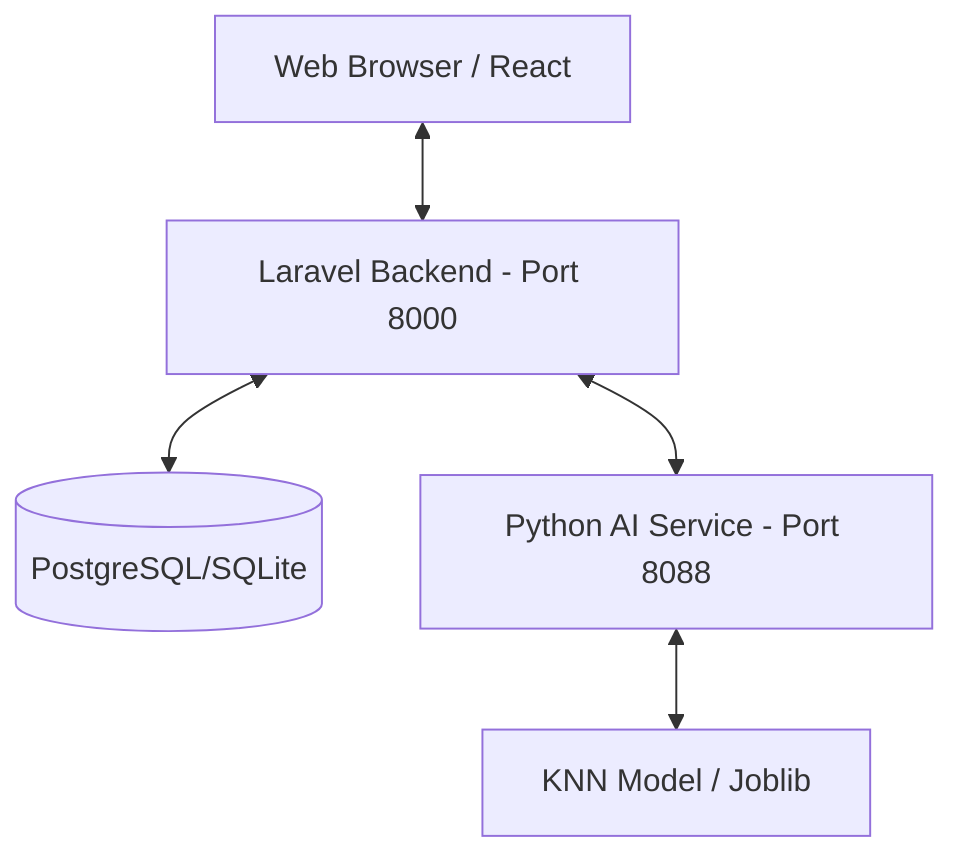

# Sikawan2 — Sistem Kehadiran Wajah Karyawan

[](https://laravel.com)
[](https://python.org)
[](https://reactjs.org)
[](https://tailwindcss.com)
[](LICENSE)

**Sikawan2** adalah ekosistem manajemen kehadiran modern yang mengintegrasikan kecerdasan buatan (**Face Recognition**) dengan sistem manajemen SDM yang komprehensif. Dikembangkan dengan arsitektur modular, sistem ini memisahkan mesin pengenalan wajah dari logika bisnis inti untuk memastikan skalabilitas dan performa tinggi.

---

## 📋 Daftar Isi

- [✨ Fitur Utama](#-fitur-utama)
- [🏗️ Arsitektur Sistem](#️-arsitektur-sistem)
- [📁 Struktur Proyek](#-struktur-proyek)
- [🛠️ Tech Stack](#️-tech-stack)
- [📦 Prasyarat](#-prasyarat)
- [🚀 Quick Start](#-quick-start)
- [⚙️ Konfigurasi](#️-konfigurasi)
- [🛠️ Command Center (Makefile)](#️-command-center-makefile)
- [🚢 Deployment](#-deployment)
- [📄 Lisensi](#-lisensi)

---

## ✨ Fitur Utama

### 🤖 AI Face Recognition

- **Face Detection**: Menggunakan algoritma **Haar Cascade** yang handal untuk mendeteksi wajah dalam berbagai kondisi pencahayaan.
- **Algoritma KNN**: Klasifikasi identitas menggunakan model K-Nearest Neighbors yang efisien.
- **Biometric Dynamic**: Verifikasi wajah real-time dengan evaluasi kualitas frame dan stabilitas embedding.
- **Dataset Sintetis**: Generator dataset otomatis untuk melatih model dengan ribuan variasi wajah karyawan.

### 💼 Manajemen Kehadiran

- **Geofencing**: Validasi kehadiran berdasarkan lokasi GPS kantor.
- **Shift & Penjadwalan**: Fleksibilitas pengaturan jam kerja, toleransi keterlambatan, dan lembur.
- **Workflow Persetujuan**: Pengajuan cuti, izin, dan lembur yang terintegrasi.

### 📊 Analisis & Insight

- **Real-time Dashboard**: Pantau statistik kehadiran harian secara langsung.
- **Audit Log**: Jejak aktivitas digital lengkap untuk keamanan dan akuntabilitas.
- **Performance Metrics**: Skor performa karyawan berdasarkan tingkat kehadiran dan jam kerja.

---

## 🏗️ Arsitektur Sistem

Sikawan2 beroperasi sebagai ekosistem microservices terintegrasi:



---

## 📁 Struktur Proyek

```bash
sikawan2/
├── laravel-presensi/         # Web App & Logic (Laravel + React)
│   ├── app/                 # Logic Backend (PHP)
│   ├── resources/js/        # Frontend UI (React + Inertia)
│   └── public/              # Assets & Entry Point
├── skripsi-presensi-ai/      # Face Recognition Engine (FastAPI)
│   ├── src/                 # Source Code Python
│   ├── models/              # Trained Model Files (.joblib)
│   └── dataset/             # Face Embedding Dataset
├── Makefile                 # Orchestration Commands
└── docker-compose.yml       # Production Deployment Config
```

---

## 🛠️ Tech Stack

### Backend & Web App (Laravel)
- **Framework**: Laravel 11 (PHP 8.2+)
- **Architecture**: Inertia.js (Server-side Routing)
- **Database**: PostgreSQL (Production) / SQLite (Development)
- **Frontend**: React 18, TypeScript, Tailwind CSS v4
- **UI Components**: Shadcn UI, Radix UI, Lucide Icons

### AI Service (Python)
- **Framework**: FastAPI (Uvicorn)
- **AI Engine**: OpenCV (**Haar Cascade**), Face-recognition (dlib), Scikit-learn (**KNN**)
- **Processing**: NumPy, Joblib, Pydantic v2
- **Utilities**: Aiohttp, Psutil

---

## 📦 Prasyarat

Sebelum memulai, pastikan sistem Anda memiliki:

- **PHP** >= 8.2 & **Composer**
- **Node.js** >= 20 & **NPM**
- **Python** >= 3.10 & **pip**
- **Make** (Opsional, sangat disarankan)
- **SQLite** atau **PostgreSQL**

---

## 🚀 Quick Start

Cara tercepat untuk menjalankan seluruh ekosistem adalah menggunakan **Makefile**:

```bash
# 1. Clone repository
git clone https://github.com/Rizky28eka/skripsi.git
cd sikawan2

# 2. Setup environment & install dependencies (Laravel + AI)
make install

# 3. Jalankan database migration, seeder, & latih AI awal
make seed

# 4. Jalankan seluruh layanan (AI, Web Server, Queue, Vite)
make dev
```

Sistem akan tersedia di:
- **Web App**: `http://localhost:8000`
- **AI Service**: `http://localhost:8088`

---

## ⚙️ Konfigurasi

### AI Service (`skripsi-presensi-ai/.env`)
```env
RECOGNITION_THRESHOLD=0.55    # Sensitivitas pengenalan (0-1)
AUGMENTATION_COUNT=100        # Jumlah variasi dataset sintetis per user
DATASET_STORAGE=filesystem    # Mode penyimpanan (filesystem/database)
```

### Laravel Backend (`laravel-presensi/.env`)
```env
AI_SERVICE_URL=http://localhost:8088
DB_CONNECTION=sqlite          # Gunakan pgsql untuk produksi
```

---

## 🛠️ Command Center (Makefile)

Gunakan perintah ini untuk manajemen proyek yang lebih efisien:

| Perintah | Deskripsi |
| :--- | :--- |
| `make install` | Inisialisasi total (Env, Dependencies, Models) |
| `make dev` | Jalankan ekosistem dev secara paralel (Hot Reload) |
| `make seed` | Reset database & regenerasi dataset sintetis |
| `make train-ai` | Latih ulang model KNN dengan data terbaru |
| `make reset` | Bersihkan artefak dan instal ulang dari nol |
| `make clean` | Bersihkan logs, cache, dan dataset sementara |
| `make logs` | Pantau log sistem (Laravel & AI) secara real-time |
| `make lint` | Jalankan analisis kode statis (PHP dan Python) |

---

## 🚢 Deployment

Proyek ini siap untuk di-deploy menggunakan Docker:

```bash
# Jalankan production stack (Laravel + AI + PostgreSQL + Traefik)
docker-compose up -d
```

Pastikan Anda telah menyesuaikan domain dan sertifikat SSL pada label Traefik di `docker-compose.yml`.

---

## 📄 Lisensi

Dikembangkan sebagai bagian dari Tugas Akhir/Skripsi. Seluruh hak cipta pada pengembang.

**Dibuat dengan ❤️ oleh [Rizky28eka](https://github.com/Rizky28eka)**
